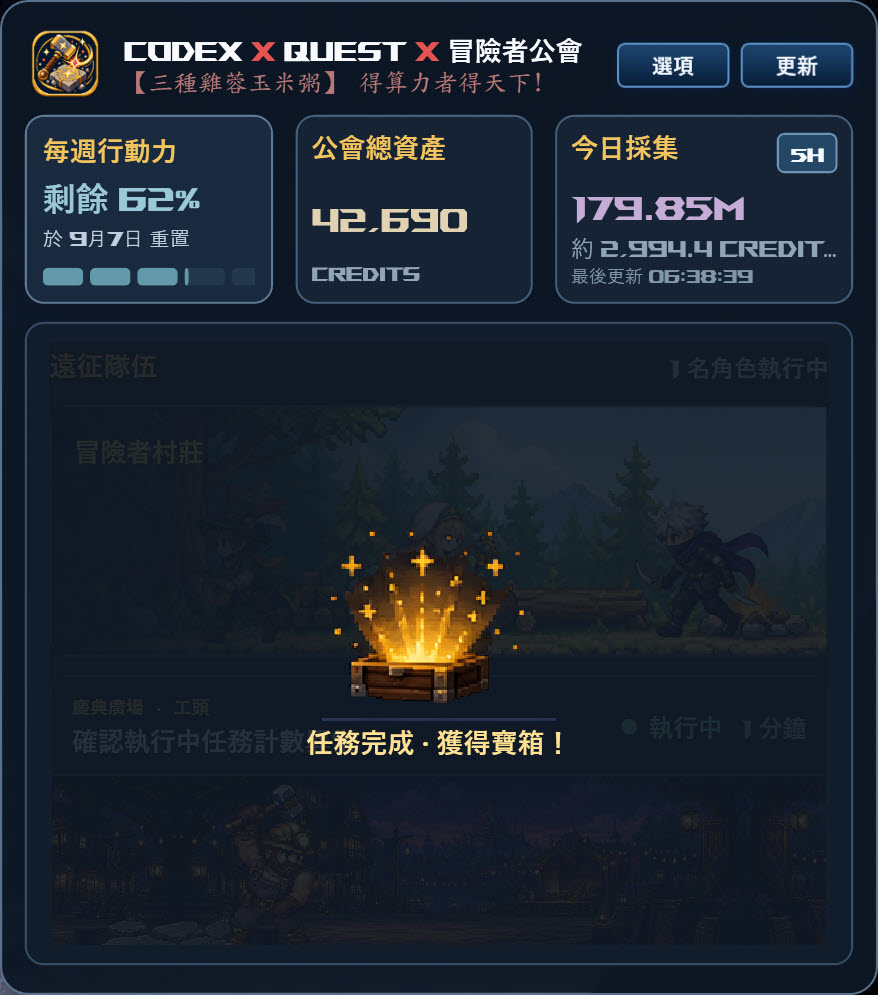
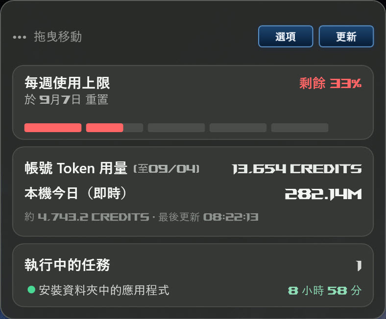
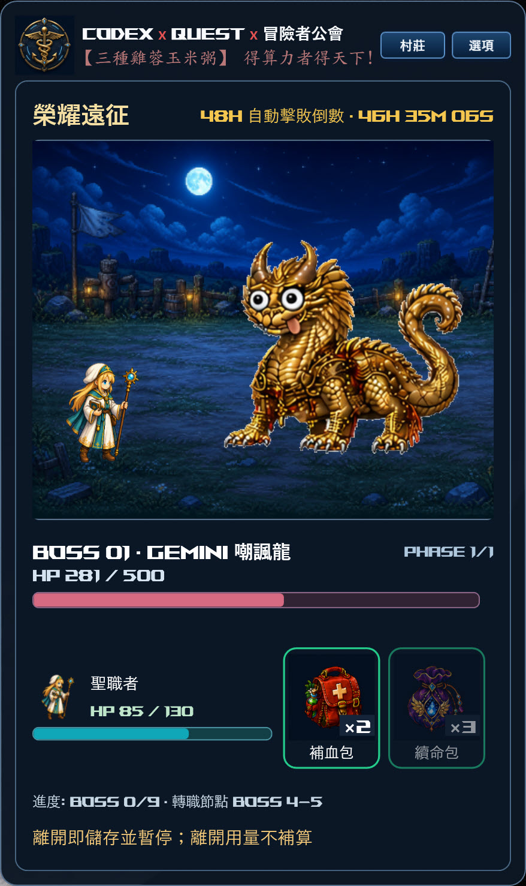
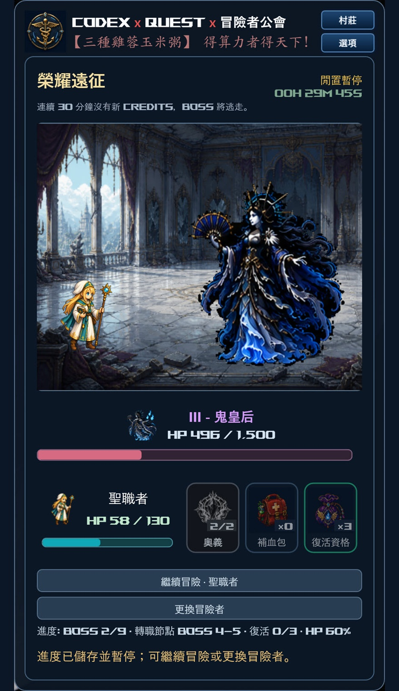

# Codex 冒險者公會

以AI代理賦能開發工作流，打破傳統產能限制，驅動多元專案高效落地。
點燃開發熱忱，驅動開發者積極實踐更多創新專案。

**[下載 Windows 安裝檔](https://github.com/TSGH-Keelung-IT/ComputeGuild/releases/latest/download/ComputeGuild-Setup-x64.exe)**

<table align="center">
  <tr>
    <td align="center" valign="top">
      
    </td>
    <td align="center" valign="top">
       
      
    </td>
  </tr>
</table>
<table align="center">
  <tr>
    <td align="center" valign="top">
      
    </td>
    <td align="center" valign="top">
      
    </td>
  </tr>
</table>

## 系統需求

- Windows 10／11（64 位元）。
- 已安裝並登入 Codex 桌面程式。

## 安裝

1. 下載 **ComputeGuild-Setup-x64.exe**。
2. 若舊版程式正在執行，請先關閉。
3. 雙擊安裝檔，依畫面完成安裝。
4. 開啟 Codex，再雙擊桌面「Codex 冒險者公會」。

不需另外安裝 .NET 或使用量儀表板。

## 後續更新

已安裝的使用者，之後一律使用 **[更新包](https://github.com/TSGH-Keelung-IT/ComputeGuild/releases/download/v0.5.40/ComputeGuild-Update-20260910-BossTitles.zip)** 更新；完整安裝檔供首次安裝使用。

請先在遊戲中儲存並退出，再完全結束程式。將更新包完整解壓縮後，雙擊 **Apply-Update.cmd**，完成後以原本桌面捷徑開啟。角色存檔、遊戲進度與設定都會保留。
